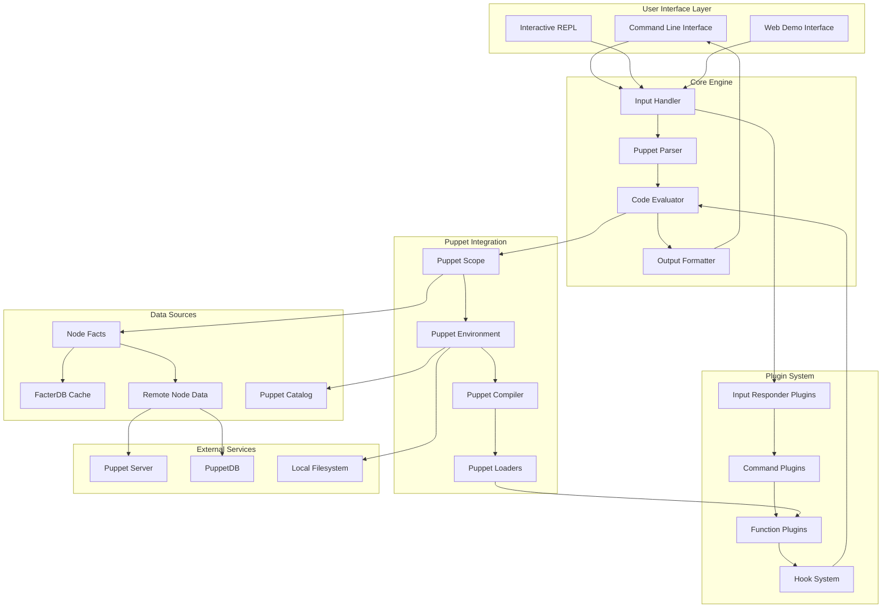
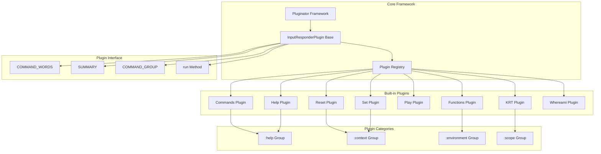
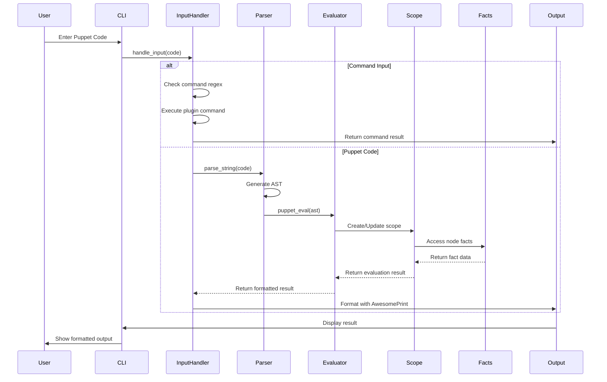
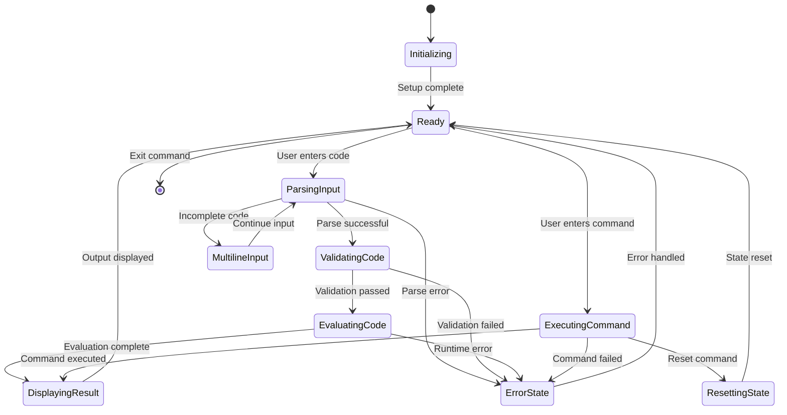
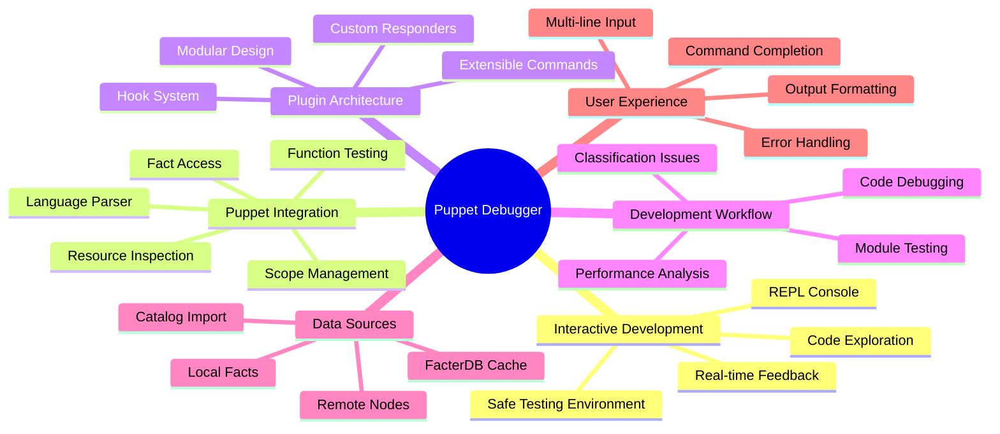
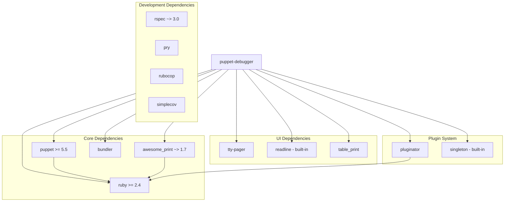
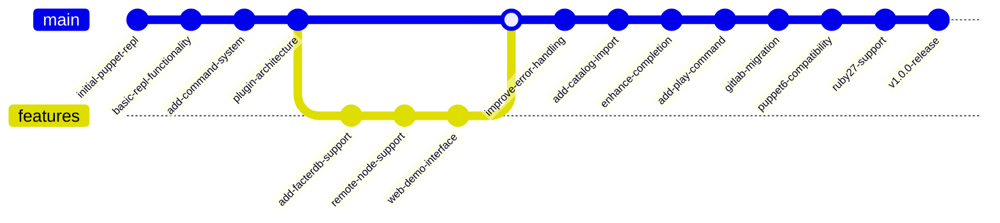

# **Presentation Puppet Debugger**

[Homepage](https://github.com/enogrob/presentation-puppet-debugger)


## Contents

- [Summary](#summary)
- [Architecture](#architecture)
  - [Alternative Perspectives](#alternative-perspectives)
  - [Key Concepts](#key-concepts)
- [Tech Stack](#tech-stack)
- [Getting Started](#getting-started)
- [Usage Examples](#usage-examples)
- [Contributing Guidelines](#contributing-guidelines)
- [Troubleshooting](#troubleshooting)
- [License](#license)
- [References](#references)

### Summary

The Puppet Debugger is an interactive command-line REPL (Read-Eval-Print Loop) tool designed for evaluating and debugging Puppet language code. Created by NWOps and primarily developed by Corey Osman, this tool provides developers with a powerful environment to test, explore, and debug Puppet manifests without the need to compile full catalogs or apply changes to systems.

The Puppet Debugger serves as an essential development tool for Puppet practitioners, allowing them to interactively experiment with Puppet code, inspect variables, test functions, and understand how the Puppet language behaves in real-time. Unlike traditional `puppet apply` workflows, the debugger focuses purely on code evaluation and parsing, making it safe to use during development as it never actually enforces configurations on the target system.

This tool is particularly valuable for DevOps engineers, system administrators, and Puppet developers who need to understand complex Puppet logic, debug classification issues, test custom functions, or explore the behavior of existing Puppet modules. The debugger supports remote node inspection, facts exploration, and provides extensive plugin architecture for extensibility.

### Architecture



#### Alternative Perspectives

<details>
<summary><strong>1. Component Architecture - Plugin System</strong> (Click to expand)</summary>



</details>

<details>
<summary><strong>2. Data Flow Architecture</strong> (Click to expand)</summary>



</details>

<details>
<summary><strong>3. State Management Diagram</strong> (Click to expand)</summary>



</details>

<details>
<summary><strong>4. Mind Map - Interconnected Themes</strong> (Click to expand)</summary>



</details>

<details>
<summary><strong>5. Ruby Gem Dependencies</strong> (Click to expand)</summary>



</details>

<details>
<summary><strong>6. Git Graph - Project Evolution</strong> (Click to expand)</summary>



</details>

#### Key Concepts

* **REPL (Read-Eval-Print Loop)**: Interactive programming environment that takes single user inputs, evaluates them, and returns the result to the user, providing immediate feedback for Puppet code experimentation.

* **Puppet Scope**: The context in which Puppet code is evaluated, containing variables, facts, and other data that influences how resources and functions behave within the debugger environment.

* **Input Responder Plugins**: Modular command system that allows extending the debugger with custom commands, each plugin handles specific user inputs and provides specialized functionality.

* **FacterDB Integration**: Cached fact system that provides pre-collected system facts from various operating systems, eliminating the need to gather facts from the local system and speeding up debugger startup.

* **Remote Node Support**: Capability to connect to a Puppet server and retrieve real node data including facts, classes, and parameters, enabling debugging of actual production configurations.

* **Safe Evaluation**: Code execution mode that parses and evaluates Puppet code without building catalogs or enforcing resources, ensuring no system changes are made during debugging sessions.

* **Manifest Playground**: Environment where users can test Puppet manifests, functions, and resource declarations without the overhead of full Puppet runs or the risk of system modifications.

* **Hook System**: Event-driven mechanism that allows plugins and extensions to execute code at specific points in the debugger lifecycle, enabling advanced customization and monitoring.

* **Multi-line Input**: Parser capability that detects incomplete Puppet code blocks and allows users to continue input across multiple lines until a complete, valid statement is formed.

* **Command Completion**: Intelligent auto-completion system that suggests available commands, variables, functions, and Puppet language keywords based on the current context and user input.

### Tech Stack

* **Programming Language**: Ruby (>= 2.4) - Core language for the debugger implementation
* **Framework**: Puppet (>= 5.5) - Integration with Puppet's parsing and evaluation engine
* **REPL Interface**: Readline - Command-line editing and history functionality
* **Output Formatting**: AwesomePrint (~> 1.7) - Enhanced object inspection and pretty-printing
* **Plugin System**: Pluginator - Modular plugin discovery and loading framework
* **Table Display**: TablePrint - Formatted table output for function and command listings
* **Paging**: TTY::Pager - Terminal pager for handling large output content
* **Testing Framework**: RSpec (~> 3.0) - Unit and integration testing suite
* **Code Quality**: RuboCop - Ruby static code analyzer and formatter
* **Coverage**: SimpleCov - Code coverage measurement tool
* **Development**: Pry - Enhanced debugging and development console
* **Build System**: Bundler - Ruby dependency management and build tool
* **Distribution**: RubyGems - Package distribution platform
* **Documentation**: YARD - Ruby documentation generation tool
* **CI/CD**: GitLab CI - Continuous integration and deployment pipelines
* **Version Control**: Git - Source code management hosted on GitLab
* **Dependency Management**: Gemspec - Ruby gem specification and dependency declaration
* **Environment Management**: Puppet environments - Puppet code organization and isolation

### Getting Started

**System Requirements:**
- Ruby 2.4 or higher
- Puppet 5.5 or higher
- Unix-like operating system (Linux, macOS) or Windows with proper Ruby support

**Installation:**

1. **Install the Puppet Debugger gem:**
   ```bash
   gem install puppet-debugger
   ```

2. **Verify installation:**
   ```bash
   puppet debugger --version
   ```

3. **Start the debugger:**
   ```bash
   puppet debugger
   ```

**Configuration Options:**

4. **Using FacterDB for faster startup (recommended):**
   ```bash
   puppet debugger --facterdb-filter 'operatingsystem=CentOS'
   ```

5. **Connect to remote node for real facts:**
   ```bash
   puppet debugger --node-name my-server.example.com
   ```

6. **Load code from file:**
   ```bash
   puppet debugger --play /path/to/manifest.pp
   ```

7. **Execute code and exit:**
   ```bash
   puppet debugger --execute "notice('Hello World')"
   ```

**Environment Setup:**

8. **Set log level for debugging:**
   ```bash
   puppet debugger --log-level debug
   ```

9. **Import existing catalog for inspection:**
   ```bash
   puppet debugger --catalog /path/to/catalog.json
   ```

10. **Quick test mode:**
    ```bash
    echo "notice('test')" | puppet debugger --test
    ```

### Usage Examples

**Basic REPL Usage:**
```puppet
1:>> $facts['operatingsystem']
 => "CentOS"

2:>> $uptime_days
 => "5 days"

3:>> notice("System has been up for ${uptime_days}")
 => nil

4:>> file { '/tmp/test': ensure => present }
 => File[/tmp/test] {
  ensure => 'present'
}
```

**Working with Variables:**
```puppet
1:>> $my_var = 'hello world'
 => "hello world"

2:>> $my_array = [1,2,3,4]
 => [1, 2, 3, 4]

3:>> $my_array.each |$item| { notice($item) }
 => [1, 2, 3, 4]
```

**Function Testing:**
```puppet
1:>> functions
 => # Lists all available functions

2:>> md5('some string')
 => "5ac749fbeec93607fc28d666be85e73a"

3:>> upcase('hello world')
 => "HELLO WORLD"
```

**Resource Exploration:**
```puppet
1:>> user { 'testuser': ensure => present, home => '/home/testuser' }
 => User[testuser] {
  ensure => 'present',
  home => '/home/testuser'
}

2:>> service { 'httpd': ensure => running, enable => true }
 => Service[httpd] {
  ensure => 'running',
  enable => true
}
```

**Multi-line Code Blocks:**
```puppet
1:>> if $facts['operatingsystem'] == 'CentOS' {
  >>   notice('This is CentOS')
  >> } else {
  >>   notice('This is not CentOS')
  >> }
 => nil
```

**Command Usage:**
```puppet
1:>> commands
 # Shows all available debugger commands

2:>> help
 # Shows help screen

3:>> functions apache
 # Lists functions containing 'apache'

4:>> reset
 # Resets debugger state

5:>> play https://gist.github.com/logicminds/example.pp
 # Loads and executes remote code
```

### Contributing Guidelines

The Puppet Debugger project welcomes contributions from the community. The project is hosted on GitLab at https://gitlab.com/puppet-debugger/puppet-debugger.

**Getting Started with Development:**

1. **Fork the repository** on GitLab
2. **Clone your fork** locally:
   ```bash
   git clone https://gitlab.com/your-username/puppet-debugger.git
   cd puppet-debugger
   ```

3. **Install development dependencies:**
   ```bash
   bundle install
   ```

4. **Run the test suite:**
   ```bash
   bundle exec rspec
   ```

**Development Workflow:**

- Create feature branches from the main branch
- Write tests for new functionality using RSpec
- Follow Ruby style guidelines enforced by RuboCop
- Ensure all tests pass before submitting merge requests
- Update documentation for new features or changes

**Code Standards:**

- Follow Ruby community style guidelines
- Use RuboCop for code formatting and style checks
- Write comprehensive tests for new features
- Document public APIs and complex functionality
- Keep commit messages clear and descriptive

**Plugin Development:**

The debugger supports custom plugins through the InputResponderPlugin system. See `Plugin_development.md` for detailed plugin development guidelines.

**Reporting Issues:**

- Use GitLab Issues to report bugs or request features
- Provide clear reproduction steps for bugs
- Include system information (Ruby version, Puppet version, OS)
- Search existing issues before creating new ones

### Troubleshooting

**Common Issues and Solutions:**

**Q: Debugger fails to start with "command not found"**
A: Ensure the puppet-debugger gem is installed and the gem bin directory is in your PATH. Try `gem install puppet-debugger` and verify with `which puppet-debugger`.

**Q: Getting permission errors when connecting to remote nodes**
A: Check your Puppet server's auth.conf file to ensure your node has permission to retrieve node information. You may need to add authentication rules for the debugger.

**Q: FacterDB fails to load or gives errors**
A: Try updating the facterdb gem with `gem update facterdb` or disable FacterDB with `--no-facterdb` flag to use local facts instead.

**Q: Puppet code works in apply but fails in debugger**
A: The debugger doesn't enforce resources, only evaluates code. Some provider-specific behavior won't work. Focus on testing logic and syntax rather than actual resource enforcement.

**Q: Multi-line input not working properly**
A: Ensure your terminal supports readline properly. Try installing the readline development libraries and reinstalling Ruby with readline support.

**Q: Performance issues on startup**
A: Use FacterDB for faster startup: `puppet debugger --facterdb-filter 'operatingsystem=CentOS'` instead of gathering local facts.

**Getting Help:**

- Check the official documentation (when available)
- Review example code in the repository
- Ask questions in Puppet community forums
- Submit issues on GitLab for bugs or feature requests

### License

The Puppet Debugger is released under the MIT License.

**Copyright (c) 2018 NWOPS, LLC**

Permission is hereby granted, free of charge, to any person obtaining a copy of this software and associated documentation files (the "Software"), to deal in the Software without restriction, including without limitation the rights to use, copy, modify, merge, publish, distribute, sublicense, and/or sell copies of the Software, and to permit persons to whom the Software is furnished to do so, subject to the following conditions:

The above copyright notice and this permission notice shall be included in all copies or substantial portions of the Software.

**License Type**: MIT
**Copyright Holder**: NWOPS, LLC
**Year**: 2018

Full license text available at: https://gitlab.com/puppet-debugger/puppet-debugger/-/blob/main/LICENSE.txt

### References

* [Puppet Debugger Official Repository](https://gitlab.com/puppet-debugger/puppet-debugger) - Main project repository hosted on GitLab with source code, documentation, and issue tracking
* [GitHub Mirror Repository](https://github.com/nwops/puppet-debugger) - Read-only mirror of the project on GitHub (note: main development has moved to GitLab)
* [RubyGems Package](https://rubygems.org/gems/puppet-debugger) - Official gem distribution for easy installation via `gem install puppet-debugger`
* [Puppet Debugger Demo](http://demo.puppet-debugger.com/) - Web-based demo interface for trying the debugger online without local installation
* [Using the Puppet Debugger for Lightweight Exploration - YouTube](https://www.youtube.com/watch?v=VVr4rU_9A_w) - Video tutorial by Corey Osman demonstrating debugger usage and features
* [Puppet Official Documentation](https://puppet.com/docs/puppet/7/installing_and_upgrading.html) - Official Puppet installation and upgrade documentation for setting up the prerequisite environment
* [Puppet Full Course Tutorial - YouTube](https://www.youtube.com/watch?v=F-NGOvYiV9g) - Comprehensive Puppet learning resource that complements debugger usage for understanding Puppet fundamentals
* [Puppet VS Code Tips and Tricks - YouTube](https://www.youtube.com/watch?v=RT_e7kCyCH8) - Development environment setup that pairs well with debugger workflow
* [Puppet Hiera Introduction - YouTube](https://www.youtube.com/watch?v=vz4SWAVHFR0) - Understanding Hiera data structures that can be explored within the debugger
* [FacterDB Project](https://github.com/camptocamp/facterdb) - Cached facts database system integrated with the debugger for faster startup and cross-platform testing
* [Installation Guide Gist](https://gist.github.com/enogrob/e7d8482b3a3d9a497c2a42ef950cc3e2) - Community-contributed installation guide for Ubuntu systems
* [Puppet Language Documentation](https://puppet.com/docs/puppet/latest/lang_summary.html) - Essential reference for understanding Puppet syntax and constructs that can be tested in the debugger
* [Puppet Debugger Presentation PDF](docs/presentation-puppet-debugger.pdf) - Comprehensive presentation slides covering Puppet Debugger features, usage examples, and best practices
* [Puppet Debugger Learning Session PDF](docs/Puppet%20Debugger%20Presentation_d15f6479049243bd9a9b7e213fd0c66f-260522-1417-234.pdf) - Learning session on Puppet Debugger

